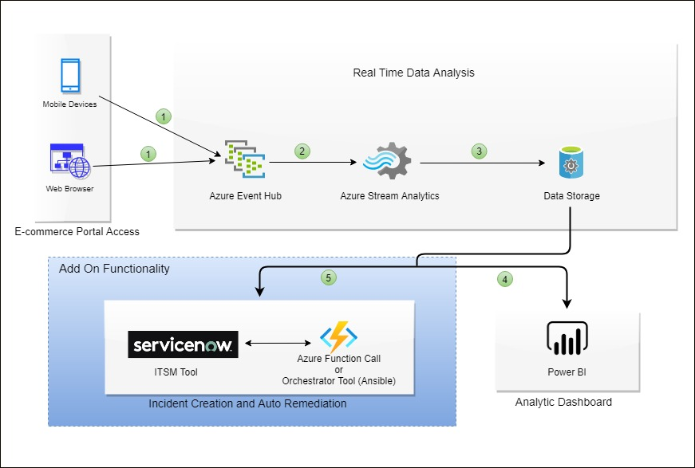
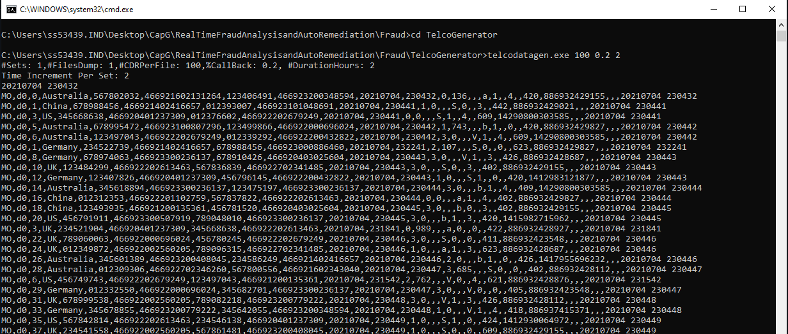
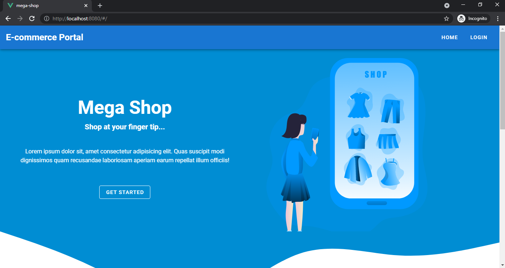

# Real-Time Fraud Detection, Auto Incident Creation & Remediation
This is a complete solution on Real Time Fraud Detection , Analysis , Auto Incident Creation &amp; Remediation on any e-commerce portal developed on top of Microsoft Azure Tech Stack. Checks every event on portal and then analysis whether it is fraudulent or not 

## Solution Architecture

## Tech Stack Used
1. Azure Event Hub
2. Azure Stream Analytics
3. Azure Functions
4. Azure Data Storage
5. Power BI
6. Service Now
7. Ansible

## Working (Data Flow)
1. User based events gets captured from e-commerce protal to Azure Event Hub
2. Azure Event Hub streamline those data to Azure Stream Analytics where every data is anaylized
3. After Processing Azure Stream Analytics pass those fraudulent data to Azure Functions and Azure Power BI (can also add storage if needed)
4. Azure Function Capture those data and create a service incident in Service Now with Fraud details and assign it to IT Security Group for further action
5. Azure Function also add fraud data to a temporary block list created in Service Now , which can be used for further references
6. Azure PowerBI capture the output of Azure Stream Analytics and then show the fraud data in a Real Time Dashboard in form of Charts and tables
7. Web Portal constantly check the block list in Service Now to check the user is fraudulent or not

## Solution Benefit
1. Cloud based solution thus can be easily scale up and down
2. Created after observing current IT Service Managment Methodology and thus can be integrated with any bussiness usecase across any  bussiness tower
3. Kept Current IT Process Automation and zero effort deployment in mind.
4. Reduces Man Power to handle the request as detection and remediation both are automation 

## Prerequisites

- Download [TelcoGenerator.zip](http://download.microsoft.com/download/8/B/D/8BD50991-8D54-4F59-AB83-3354B69C8A7E/TelcoGenerator.zip) from the Microsoft Download Center
- Optional: Source code of the event generator from [GitHub](https://github.com/Azure/azure-stream-analytics/tree/master/DataGenerators/TelcoGenerator)
- Azure Subscription , if not - [Create Account](https://azure.microsoft.com/en-in/)
- Service Now Instance, if not present can create a developer instances which is free - [Service Now Developer Instance](https://developer.servicenow.com/dev.do)
- PowerBI Pro License, can have free trail of 30days if you have a work email address. [PowerBI Free Trail](https://powerbi.microsoft.com/en-us/)

## Configuration Steps

1. Create **Azure Event Hub** and to grant access to event hub we wil need to create **Shared Access Policy** and store the connection string
2. Download the [TelcoGenerator.zip file](https://github.com/Azure/azure-stream-analytics/tree/master/DataGenerators/TelcoGenerator)
3. Replace the Microsoft.ServiceBus.ConnectionString and EventHubName values in **telcodatagen.exe.config** with your Event Hub connection string and name.

    **Note**: The connection string copied from the Azure portal places the name of the connection at the end. Be sure to remove the ";EntityPath=<value>" from the add key=  field.
4. Start the application. The usage is as follows:

       telcodatagen.exe [#NumCDRsPerHour] [SIM Card Fraud Probability] [#DurationHours]

   The following example will generate 1000 events with a 20 percent probability of fraud over the course of 2 hours.

       telcodatagen.exe 1000 .2 2
   
   ## Simulated Call Data
   
  
   You will see records being sent to your Event Hub. Some key fields that we will be using in this real-time fraud detection application are defined here:

   | Record | Definition |
   | ------------- | ------------- |
   | CallrecTime | Timestamp for the call start time. |
   | SwitchNum | Telephone switch used to connect the call. |
   | CallingNum | Phone number of the caller. |
   | CallingIMSI | International Mobile Subscriber Identity (IMSI).  Unique identifier of the caller. |
   | CalledNum | Phone number of the call recipient. |
   | CalledIMSI | International Mobile Subscriber Identity (IMSI).  Unique identifier of the call recipient. |
  
5. Create Stream Analytics job
   Now that we have a stream of telecommunications events, we can set up a Stream Analytics job to analyze these events in real-time. Inside Stream Analytics Job we will need to create 3 things (Input, Query, Output)
   - **INPUT** : In your Stream Analytics job click **Inputs** from the top of the page, and then click **Add Input**. The dialog box that opens will walk you through a number of steps to set up your input. (Set target to Event Hub)
   - **QUERY** : In your Stream Analytics job click **Query** from the top of the page, and then click **Add Query**. Copy Paste the query from the above repository (Azure Components/SolutionRepo/StreamAnalyticJob.txt)
   - **OUTPUT** : In your Stream Analytics job click **Outputs** from the top of the page, and then click **Add Output**. Add 2 different output ( Azure Function and PowerBI). For powerBi need to authorize with PowerBI Pro Account
  
6. Create Azure Function call
   Now to make everything functional , we need to create **Http Trigger** Function and copy pase code from (Azure Components/SolutionRepo/AzureFunction.txt)
   **NOTE** we need to change the ServiceNOw URL with your Service Now URL also username and password
  
7. Create Service Now Temporary Table for blocklist
   Go to System Table and click on Tables from the drop down > Now click on New and give name as ( fraud call list)and click on submit button
   After table creation we will need to add columns to table
   | Column Name | Type |
   | ------------- | ------------- |
   | Caller IMSI Number | String |
   | Caller Number 1 | String |
   | Location | String |
   | Caller Number 2 | String |
   | Location2 | String |
   | Time | String |
  
8. Web Portal (Dummy Ecommerce Website)
   
   ### Create a directory on your local and switch to that directory and run the command
          git init
   
   ### Install all the dependencies
          git install --save
  
   ### Start the server
          npm run serve
      
   **NOTE** Since server is up and running can check the deployment on (http://localhost:8080)
  
   ## Ecommerce Portal
   
  
  
 9. CORS enable on Service Now
    Need to enalbe **CORS** on Serivce Now and for that need to create CORS rule in service now which will allow traffic from localhost:8000
    Go to CORS rule > Add rule > Set target to Table API > Allowed to http://localhost:8000 > click submit
  
  
Now Solution is up and running which will detect the fraud and will provide realistice view to it.
   
## Reference Used
   - Azure Documentation on Real Time Fraud, [LINK](https://docs.microsoft.com/en-us/azure/architecture/example-scenario/data/fraud-detection)
  
  
   
  
